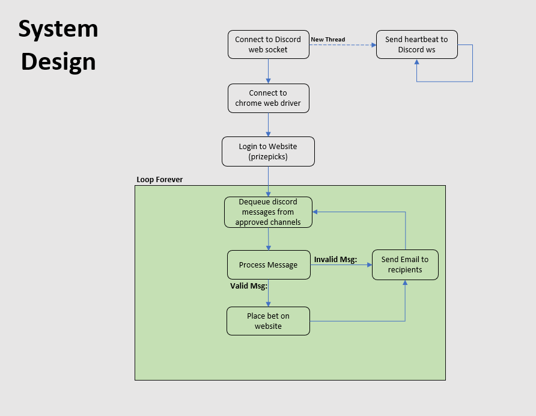

# The Howard Ratner of Bots

## Description

Python bot used to read messages from discord chanels (https://twitter.com/OxJuiced), parse messages, and place slips autonomously.
To ensure placement of best line value, slips need to be placed as quickly as possible. This bot significantly minimizes time needed to place slips.

Currently the bot is only designed for prizepicks, but with additional proper configuration could work for other websites as well.

## Table of Content

- [Description](#description)
- [Features](#features)
- [What Is EV Betting](#what-is-ev-betting)
- [Setup](#Setup)
- [Env Vars](#env-vars)
- [Disclaimer](#disclaimer)
- [Diagram](#diagram)
- [Contact](#contact)

## Features

- Can be configured to listen to messages in any discord channel (see settings.py)
- Parses messages for additional information (unit size recommendations, cancel slip warnings, etc.)
- Before placing any slips, checks to ensure no player lines have bumped (if player lines have bumped, slip won't place & an email will be sent to notify the owner)
- MAX_BET_SIZE comparision to ensure no errant slip amounts
- Email notification system (emails are sent on both successful & unsuccessful placement with proper identifying information)
- error & additional information logging

## What is EV Betting:

Here's a video that explains what EV betting is: https://www.youtube.com/watch?v=y8HopDn4M9A

## Setup

Setting up the bot should be fairly simple and should mostly require properly env var configuration (see [Env Vars](#env-vars))

1. install python libraries `pip install -r requirements.txt`
2. Create `.env` file
3. Setup `env vars` for `settings.py` to vars from
4. (Optional) See `settings.py` for additional user-specific configurations (discord channels, discord roles, blocked words, etc.)
5. Run `python main.py`

# Env Vars

This project requires environment variables to run.
Most of the environment variables contain private information, so please make sure to not publicly show this information.
Env vars are read into the `settings.py`where some additional information can also be found regarding env vars.

- `DISCORD_TOKEN` : Your unqiue discord token
- `EMAIL` : login email for prizepicks
- `PASSWORD` : login password for prizepicks
- `UNIT_SIZE` : Dollar amount for 1 unit size
- `MAX_BET_SIZE` : Safety var to ensure no bets are placed over this value (my personal default is double my unit_size)
- `EMAIL_SENDER` : email address for `email_service.py` (sends emails)
- `EMAIL_PASSWORD` : password for `email_service.py`
- `EMAIL_RECIPIENT_01` : email address to receive email notifactions (can be same or different as `EMAIL_SENDER`)

## Disclaimer

Use this project at your own discretion.
I can not be held liable for any bot malfunctions / TOS violations.

## Diagram

Highlevel diagram outlining how the bot works

## Contact

I can answer questions any additional questiosn.
Feel free to reach out.

- Discord: notkevindurant#4421
